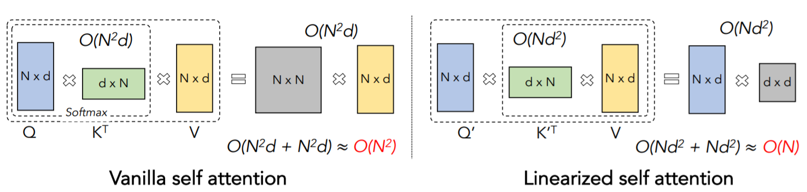

<h1 align="center">
  <b>cosFormer-PyTorch</b><br>
</h1>

<p align="center">
      <a href="https://www.python.org/">
        </a>
       <a href= "https://pytorch.org/">
        </a>
       <a href= "https://github.com/davidsvy/cosformer-pytorch/blob/main/LICENSE">
        </a>
</p>

An unofficial PyTorch implementation of the model proposed in the paper [cosFormer: Rethinking Softmax In Attention](https://openreview.net/pdf?id=Bl8CQrx2Up4) (Submitted to ICLR 2022).


<p align="center">
  
  Image stolen from the paper.
</p>


Table of contents
===

<!--ts-->
  * [➤ Paper Summary](#paper-summary)
  * [➤ Installation](#installation)
  * [➤ Usage](#usage)
  * [➤ Citations](#citations)
<!--te-->

Paper Summary
===

As many others, this paper buids on recent work on linear attention that is calculated as  instead of , where  is a kernel function. This reduces the complexity from  to . The authors propose to extend this mechanism by including relative distance information in the Q, K product as . After expanding the trigonometric identity, the full equation becomes:

<p align="center">
  
</p>

where  etc.

As the author of this repo possesses neither the time nor the ability, only the non-causal version of this approach is emplemented.


Installation
===
```
$ git clone https://github.com/davidsvy/cosformer-pytorch
$ cd cosformer-pytorch
$ pip install -r requirements.txt
```

Usage
===

```python
from models.kernel_transformer import Kernel_transformer
import torch

model = Kernel_transformer(
    # Linear attention args:
    use_cos=True,         # Whether to use the cosine reweighting mechanism prposed in the paper.
    kernel='relu',        # Kernel that approximates softmax. Available options are 'relu' and 'elu'.
    denom_eps=1e-5,       # Added to the denominator of linear attention for numerical stability.
    # If use_cos=True & kernel='relu' the model is equivalent to https://openreview.net/pdf?id=Bl8CQrx2Up4
    # If use_cos=False & kernel='elu' the model is equivalent to https://arxiv.org/pdf/2006.16236.pdf
    # Vanilla transformer args:
    d_model=512,
    n_heads=8, 
    n_layers=6,
    n_emb=20000, 
    ffn_ratio=4, 
    rezero=True,          # If True, use the ReZero architecture from https://arxiv.org/pdf/2003.04887.pdf, else the Pre-LN architecture from https://arxiv.org/pdf/2002.04745.pdf
    ln_eps=1e-5, 
    bias=False, 
    dropout=0.2, 
    max_len=1024, 
    xavier=True
)

input_ids = torch.randint(0, 20000, [4, 100])
lengths = torch.randint(1, 100, [4])
attention_mask = torch.arange(100)[None, :] < lengths[:, None]

output = model(
    input_ids=input_ids,
    lengths=lengths,
    attention_mask=attention_mask,
)
```


Citations
===

```bibtex
@inproceedings{
anonymous2022cosformer,
title={cosFormer: Rethinking Softmax In Attention},
author={Anonymous},
booktitle={Submitted to The Tenth International Conference on Learning Representations },
year={2022},
url={https://openreview.net/forum?id=Bl8CQrx2Up4},
note={under review}
}
```

